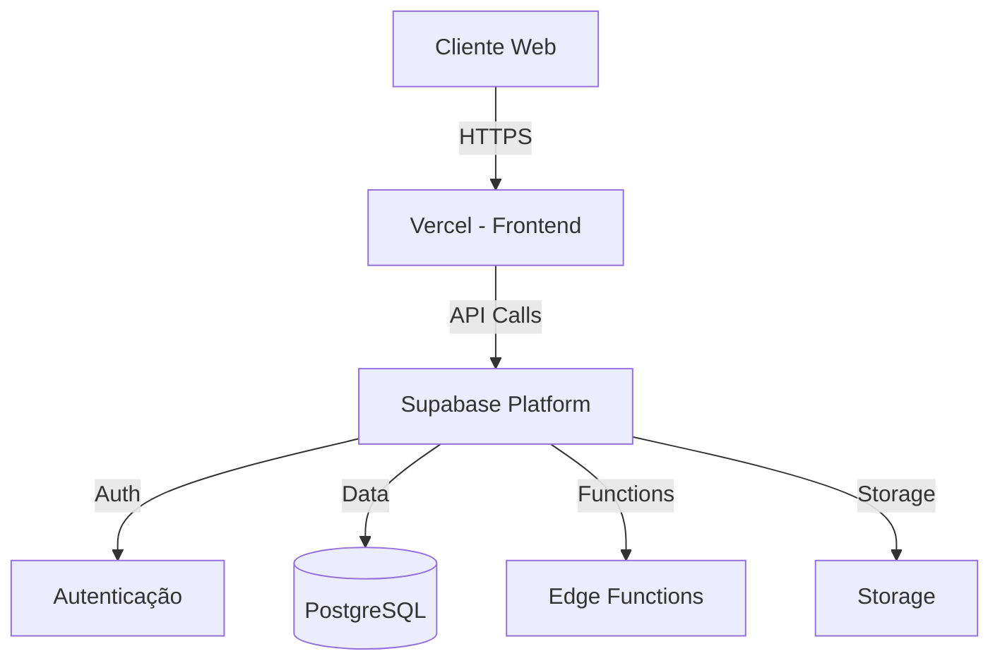

# Arquitetura do Sistema

## Visão Geral

O sistema de Ordem de Serviço é uma aplicação web moderna que utiliza:

- **Frontend**: React + Vite para uma experiência de usuário responsiva e rápida
- **Backend**: Supabase para autenticação, banco de dados e storage
- **Infraestrutura**: Edge Functions para lógica serverless

## Diagrama de Arquitetura

## Componentes Principais

### Frontend (React + Vite)

- **UI Components**: shadcn/ui + TailwindCSS
- **Forms**: React Hook Form + Zod
- **State**: React Context + Local Storage
- **API Client**: Custom hooks + Fetch API
- **Router**: React Router

### Backend (Supabase)

- **Database**: PostgreSQL com RLS (Row Level Security)
- **Auth**: JWT + Magic Link
- **API**: REST + Edge Functions
- **Storage**: S3-compatible para arquivos
- **Realtime**: WebSocket para atualizações em tempo real

## Fluxo de Dados

1. **Autenticação**
   - Login via email/senha ou magic link
   - JWT armazenado em localStorage
   - RLS ativo em todas as tabelas

2. **CRUD de OS**
   - Validação no frontend (Zod)
   - API calls via custom hooks
   - Cache local para modo offline
   - Sync automático quando online

3. **Armazenamento**
   - Fotos de equipamentos em Storage
   - PDF de OS gerado via Edge Function
   - Backup automático via PostgreSQL

## Segurança

- HTTPS em todas as comunicações
- CORS configurado por ambiente
- CSP implementado
- Sanitização de inputs
- Validação server-side
- Audit logs de ações críticas

## Performance

- Code splitting automático
- Lazy loading de rotas
- Caching de assets
- Otimização de imagens
- Minificação de JS/CSS
- Gzip/Brotli compression

## Monitoramento

- Logs estruturados
- Error tracking
- Performance metrics
- User analytics
- DB query performance

## Escalabilidade

- Serverless first
- Edge functions distribuídas
- Cache em múltiplas camadas
- Database connection pooling
- Asset CDN
